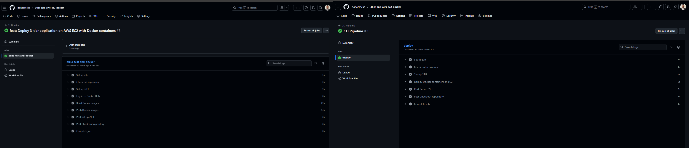
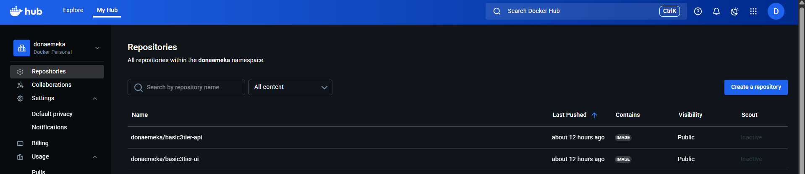
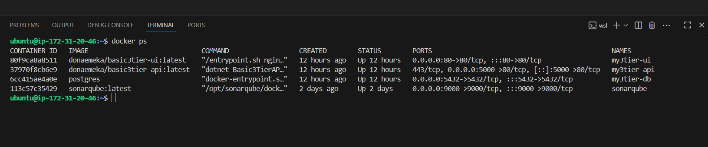
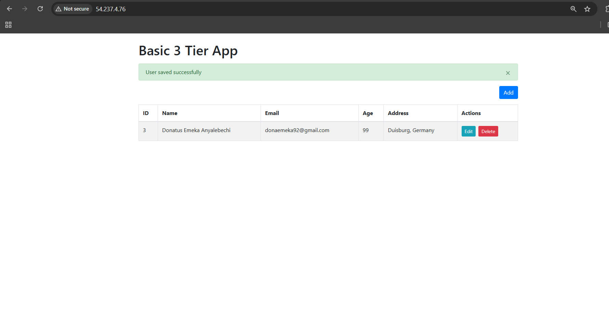
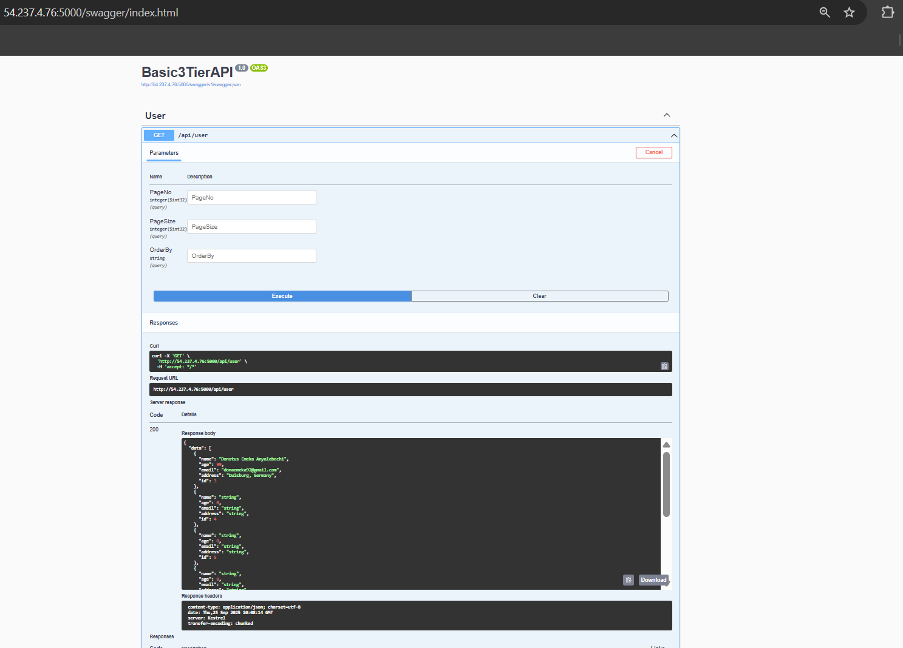

# 3-Tier Web Application on AWS EC2 with Docker  

Welcome!  
This repository contains a **3-tier web application (Frontend UI, .NET API, PostgreSQL Database)** deployed on an Amazon EC2 instance using Docker containers. This project demonstrates my journey learning modern DevOps practices: **containerization, networking, cloud deployment, and automation with CI/CD**.  

## My Project Overview: 

   - **My Goal:** To Learn end-to-end DevOps by building and deploying a production-ready application  
   - **What I Built:** A **user management CRUD system** (Add, View, Edit, Delete users) with frontend, API, and database  
   - **Where I Deployed It:** AWS EC2 using Docker containers  
   - **How I Automated It:** CI/CD pipelines with GitHub Actions  

## 🛠️ Technologies Used  

   - **Frontend:** Nginx, HTML, JavaScript  
   - **Backend:** .NET Core 7.0, Entity Framework  
   - **Database:** PostgreSQL  
   - **Infrastructure:** Docker, AWS EC2  
   - **Automation:** GitHub Actions, Docker Hub  

## 📚 Skills I Gained  

   - **Cloud Deployment:** AWS EC2, security groups, SSH management  
   - **Containerization:** Docker, Docker Compose, container networking  
   - **CI/CD Automation:** GitHub Actions for automated builds & deployments  
   - **Infrastructure as Code:** Reproducible environment setup with Docker Compose  

## 💡 Challenges I Solved  

   - Connecting containers over a Docker network  
   - Debugging API-to-Database connection issues  
   - First successful CI/CD pipeline push to Docker Hub  
   - Accessing my deployed app from anywhere via EC2 public IP  

## 🏗️ Architecture (Simple Flow)  

**Browser → EC2 Server → Frontend (Nginx) → API (.NET) → Database (Postgres)**  

   - **Frontend:** HTML/JS app served via Nginx  
   - **API:** .NET Core backend providing business logic  
   - **Database:** PostgreSQL storing all user data  
   - **Docker:** Each service isolated in a container  
   - **AWS EC2:** Host VM where everything runs  

## 🖥️ Local Development (Testing on My Machine)  

1. **Clone this repo**
   - git clone https://github.com/donaemeka/3tier-app-aws-ec2-docker.git
   - cd 3tier-app-aws-ec2-docker

2. **Start all services**
   - docker-compose up -d

3. **Check running containers**
   - docker ps

4. **Access locally:**

   - 🌐 Web: http://localhost:8085

   - 🔗 API: http://localhost:5000/api/user

   - 📖 Docs: http://localhost:5000/swagger

5. **Stop when done**

   - docker-compose down

## ☁️ AWS EC2 Deployment
1. Launch EC2 instance (Ubuntu 22.04)

2. Configure security groups:

   - HTTP (80) → Frontend

   - TCP (5000) → API

   - SSH (22) → Management

3. SSH into instance

   - ssh -i "your-key.pem" ubuntu@<EC2_PUBLIC_IP>

4. Install Docker

   - sudo apt update && sudo apt install -y docker.io
   - sudo usermod -aG docker ubuntu

5. Clone repo & deploy

   - git clone https://github.com/donaemeka/3tier-app-aws-ec2-docker.git
   - cd 3tier-app-aws-ec2-docker
   - docker-compose up -d

6. Access live app

   - 🌐 Web: http://<EC2_PUBLIC_IP>

   - 🔗 API: http://<EC2_PUBLIC_IP>:5000/api/user

   - 📖 Docs: http://<EC2_PUBLIC_IP>:5000/swagger

## ⚡ CI/CD with GitHub Actions
   
   - **CI:** Build Docker images for API & UI → Push to Docker Hub

   - **CD:** SSH into EC2 → Pull latest images → Restart containers

✅ This ensures any push to **main** branch updates the live app automatically.

## 📷 Screenshots (Showcasing My Work)

  
**My automated CI/CD pipeline building and deploying Docker images**

  
**API & UI images successfully pushed to Docker Hub**

  
**All three containers (db, api, ui) running on my EC2 instance**

  
**The frontend successfully connected to API & database via EC2 public IP**

  
**The .NET API exposed via Swagger documentation, accessible through EC2 public IP**

## 🌱 My Learning Journey
What started as a lab exercise became a complete end-to-end project where I :

✅ Added health checks & error handling

✅ Implemented environment-specific configs

✅ Set up Docker networking correctly

✅ Built CI/CD pipelines

✅ Documented everything for others to follow

## 📌 Why This Matters for My DevOps Career
This project shows I can:

   - Take a concept to production independently

   - Troubleshoot real-world infrastructure issues

   - Automate deployments with CI/CD

   - Work with modern cloud tools (AWS, Docker, GitHub Actions)

   - Learn quickly & apply new skills hands-on

## ✨ If you like this project, please give it a star!
## 📩 I am open to Junior DevOps opportunities – let’s connect!

## 👨‍💻 About Me
Donatus Emeka Anyalebechi
DevOps Engineer | Staatlich geprüfter Informatiker (Software Technology, EQF Level 6)

📍 Duisburg, Germany

📧 donaemeka92@gmail.com

💼 linkedin.com/in/donatus-devops

🐙 github.com/donaemeka 
